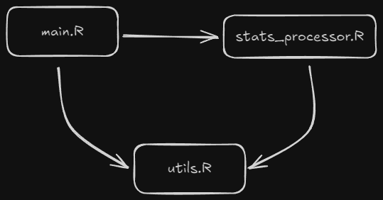

# Introduction

The objective of this project is to collect and analyze football players' statistics to gain insights into player performance and create a model to predict performance for fantasy football. In an era where data analytics plays an increasingly crucial role in sports, understanding and predicting player performance has become essential for both professional teams and fantasy football enthusiasts.

## Project Background

Fantasy football has evolved from a niche hobby into a global phenomenon, with millions of participants worldwide making weekly decisions about their virtual teams. The success in fantasy football heavily relies on the ability to accurately predict player performance based on historical data and current trends. This project aims to bridge the gap between raw statistical data and actionable insights through web scraping and advanced analytics.

## Project Objectives

The main objectives of this project are:

1. **Data Collection**: Systematically gather comprehensive player statistics from reliable football statistics websites using web scraping techniques in R. Due to the dynamically loaded nature of the target website, parsing data directly from the HTML was not possible. Instead, the data was extracted from JSON files loaded by the website, which required additional steps to identify and process the relevant API endpoints.

2. **Performance Analysis**: Analyze historical performance data to identify patterns and trends to find some unexpected insights in the data.

3. **Insight Generation**: Develop actionable recommendations for fantasy football managers based on the discovered patterns and statistical analysis.

## Significance

This project holds significance for several reasons:

1. **Practical Application**: The findings can be directly applied to fantasy football strategy, helping both casual players and experienced managers make more informed decisions about team selection and transfers in the English Premier League Fantasy game.

2. **Data Science Skills Development**: The project demonstrates the practical application of various data science skills, including:
- Web scraping
- Data cleaning and preprocessing
- JSON file parsing
- Statistical analysis
- Predictive modeling
- Data visualization

3. **Sports Analytics Innovation**: Contributing to the growing field of sports analytics by combining traditional statistics with modern data science techniques.

## Scope and Limitations

The project focuses on data from the English Premier League from season 2023/2024, scraped from [source website], with particular attention to statistics that are relevant for fantasy football scoring. While comprehensive, it's important to note that player performance can be influenced by numerous factors beyond historical statistics, such as:
- Team tactics
- Injuries
- Weather conditions
- Team chemistry
- Off-field factors

While the project aims to provide valuable insights for fantasy football managers, it's important to acknowledge its scope and limitations. Additionally, the reliance on JSON files for data extraction introduced some complexity, as the structure of the files required careful inspection and processing to ensure accurate data collection.

---

# Data Collection Process

## Architecture
The project is organized into three main files, each with a specific role in the data collection and processing pipeline:
```
project/
├── data_visualization/     # Files used in data visualization
└── data_collection/
    ├── main.R              # Main execution script
    ├── utils.R             # Utility functions for HTTP requests and data handling
    └── stats_processor.R   # Data processing and transformation functions
```

## File Responsibilities:
- `main.R`: The central script that orchestrates the entire process, including data fetching, processing, and saving.
- `utils.R`: Contains utility functions for HTTP requests, JSON parsing, and basic data operations.
- `stats_processor.R`: Implements the core logic for processing and transforming raw statistics data into structured formats.

## File Relationships:
The following diagram illustrates the relationships between the files:



`main.R` depends on `stats_processor.R` for data processing and indirectly on `utils.R` for utility functions.
`stats_processor.R` directly calls `utils.R` for HTTP requests and JSON parsing.
`utils.R` is a standalone utility file that provides reusable functions for the other scripts.

## Libraries Used
The following R libraries were used to implement the data collection process:

```{r}
library(tidyverse)  # Collection of data manipulation packages
library(httr)       # HTTP request handling
library(jsonlite)   # JSON parsing and manipulation
library(stringi)    # String manipulation

# Used for plotting
library(tidyverse)
library(ggplot2)
library(fmsb)
```

These libraries were chosen for their efficiency and ease of use in handling web scraping, JSON parsing, and data manipulation tasks.

## Key Functions

### Utils.R Functions
The `utils.R` file contains utility functions that handle HTTP requests, JSON parsing, and other basic operations. Below are some of the key functions:

```r
#' Create basic headers for HTTP requests
create_basic_headers()
# Purpose: Creates standardized headers for API requests
# Returns: List of HTTP headers

#' Fetch data from URL with retry logic
fetch_data(url, retry_count = 3, delay = 2)
# Purpose: Makes HTTP GET requests with retry mechanism
# Parameters:
#   - url: API endpoint URL
#   - retry_count: Number of retry attempts
#   - delay: Delay between retries in seconds
# Returns: HTTP response or NULL

#' Parse JSON response
parse_json_response(response)
# Purpose: Converts HTTP response to JSON object
# Parameters:
#   - response: HTTP response object
# Returns: Parsed JSON data
```

### Stats Processor Functions
The `stats_processor.R` file contains functions for processing and transforming raw statistics data. Key functions include:

```r
#' Process single statistic data
process_stat_data(stat_data, stat_title)
# Purpose: Transforms raw stat data into structured format
# Parameters:
#   - stat_data: Raw JSON data for a statistic
#   - stat_title: Name of the statistic
# Returns: Processed data frame

#' Merge multiple statistics
merge_stats(existing_df, new_df, stat_title)
# Purpose: Combines multiple statistics while handling duplicates
# Parameters:
#   - existing_df: Current combined data frame
#   - new_df: New statistics to merge
#   - stat_title: Name of the statistic
# Returns: Merged data frame
```

## Data Transformation Process
The data collection and transformation process consists of the following steps:

### Step 1: Initial Data Fetch
The main JSON file containing links to individual statistics is fetched using the fetch_data() function:
```r
# Fetch main JSON containing links to individual statistics
main_json <- fetch_data(api_url) %>% parse_json_response()
```

### Step 2: Extract Statistics Links
The JSON response is parsed to extract URLs and titles for individual statistics:

```r
# Extract URLs and titles for individual statistics
stats <- main_json$pageProps$stats$players
stat_urls <- stats$fetchAllUrl
stat_titles <- stats$header
```

### Step 3: Process Individual Statistics
Each statistic is processed using the following steps:

1. Fetch JSON data using an HTTP GET request.
2. Parse the JSON response.
3. Extract relevant fields.
4. Convert the data into a structured data frame.
5. Standardize column names.
6. Convert data types for consistency.

### Step 4: Data Cleaning
The processed data is cleaned to ensure consistency and accuracy:

1. Handle missing values.
2. Convert string values to numeric where applicable.
3. Standardize player IDs.
4. Remove duplicate information.

## Joining/Merging Strategy
To combine multiple statistics into a single dataset, a robust merging strategy was implemented:

### Key Concepts
1. Full Join: Preserves all records from both data frames.
2. Key Fields: Uses player ID and name as joining keys.
3. Conflict Resolution: Handles duplicate columns and conflicting values.

### Merging Process
The merging process is implemented in the merge_stats() function:

```r
#' Merge multiple statistics with detailed explanation
merge_stats <- function(existing_df, new_df) {
  # Step 1: Prepare keys for joining
  joining_keys <- c("ParticipantId", "ParticipantName")

  # Step 2: Handle duplicate columns
  new_df <- new_df %>%
    select(-any_of(c("TeamName", "MinutesPlayed", "MatchesPlayed")))

  # Step 3: Perform full join
  merged_df <- existing_df %>%
    full_join(
      new_df,
      by = joining_keys,
      relationship = "one-to-one"
    ) %>%
    # Step 4: Handle conflicting columns
    mutate(
      MinutesPlayed = pmax(MinutesPlayed.x, MinutesPlayed.y, na.rm = TRUE),
      MatchesPlayed = pmax(MatchesPlayed.x, MatchesPlayed.y, na.rm = TRUE)
    ) %>%
    # Step 5: Clean up temporary columns
    select(-ends_with(".x"), -ends_with(".y"))

  return(merged_df)
}
```

### Merging Rules
 - Keep the highest value for minutes and matches played.
 - Preserve player information across all statistics.
 - Handle missing values consistently.
 - Maintain data integrity during merging.

### Output Example

Here is how my data looked like:
```{r}
# data_player <- read_csv("Project/Main/temp/data/player_stats_20250130_010255.csv")
data_player <- read_csv("E:/UNI_stuff/2-sem/Web Scraping/Project/Main/temp/data/player_stats_20250130_010255.csv")

glimpse(data_player)
```

---

# Data Analysis

In this section, we analyze the collected data to uncover patterns, trends, and insights into player and team performance. The visualizations below highlight key aspects of the data, such as expected vs. actual performance, top-performing players, and team-level statistics.

## Goals vs. Expected Goals (xG)

Expected Goals (xG) is a key metric in football analytics that estimates the likelihood of a shot resulting in a goal. Comparing actual goals scored with xG provides insights into a player's finishing ability and whether they are overperforming or underperforming relative to expectations.

```{r}
# Code used for Goals vs xG plot
ggplot(data_player, aes(x = Top_scorer, y = `Expected_goals_(xG)`)) +
  geom_point(color = "blue", alpha = 0.6) +
  geom_abline(slope = 1, intercept = 0, linetype = "dashed", color = "red") +
  geom_text(
    data = data_player %>%
      filter(Top_scorer > 12 & `Expected_goals_(xG)` > 7),
    aes(label = ParticipantName),
    size = 3,
    check_overlap = T
  ) +
  labs(
    title = "Goals scored vs Expected goals (xG) per Season",
    x = "Goals scored",
    y = "Expected goals (xG)"
  ) +
  theme_minimal()

```

**Insights**:

- Players below the red dashed line are overperforming their xG, indicating exceptional finishing ability.
- Players above the line are underperforming their xG, suggesting inefficiency in converting chances.

## Assists vs. Expected assists (xA)

Expected Assists (xA) measures the likelihood that a pass will result in a goal. Comparing actual assists with xA helps identify players who are creating high-quality chances and those who are benefiting from teammates' finishing ability.

```{r}
# Assists vs xA
ggplot(data_player, aes(x = Assists, y = `Expected_assist_(xA)`)) +
  geom_point(color = "green", alpha = 0.6) +
  geom_abline(slope = 1, intercept = 0, linetype = "dashed", color = "red") +
  geom_text(
    data = data_player %>%
      filter(Assists > 9 & `Expected_assist_(xA)` > 4),
    aes(label = ParticipantName),
    size = 3,
    check_overlap = T
  ) +
  labs(
    title = "Assists vs Expected assists (xA) per Season",
    x = "Assists",
    y = "Expected assists (xA)"
  ) +
  theme_minimal()
```

**Insights**:

- Players below the red dashed line are overperforming their xA, indicating they are benefiting from teammates' finishing ability.
- Players above the line are underperforming their xA, suggesting inefficiency in converting high-quality chances into assists.

## Top 15 Players by Assists

Confirmation of data mentioned above.

```{r}
ggplot(
  data_player %>%
    arrange(desc(Assists)) %>%
    head(15),  # Top 15 players
  aes(x = reorder(ParticipantName, Assists), y = Assists, fill = TeamName)
) +
  geom_bar(stat = "identity") +
  coord_flip() +
  geom_text(
    aes(label = sprintf("%d", Assists)),
    hjust = -0.2,
    size = 3
  ) +
  labs(
    title = "Top 15 players by assists",
    x = "",
    y = "Assists",
    fill = "Team"
  ) +
  theme_minimal() +
  theme(
    plot.title = element_text(size = 14, face = "bold"),
    plot.subtitle = element_text(size = 12),
    axis.text.y = element_text(size = 10),
    legend.position = "bottom",
    legend.box = "horizontal"
  ) +
  scale_y_continuous(expand = c(0, 0, 0.1, 0)) +  # Adjust y-axis limits
  guides(fill = guide_legend(nrow = 2))  # Arrange legend in two rows

```


---

# Conclusion

The analysis of football players' statistics provided valuable insights into player performance and team dynamics. Key findings include:

- The identification of top-performing players based on goals and assists.
- A positive correlation between goals and assists, suggesting that players who excel in one area often excel in the other.
- The importance of data-driven decision-making in football management.

These findings highlight the potential of web scraping and data analysis in sports analytics. Future work could involve expanding the dataset to include more seasons or exploring advanced statistical models for player evaluation.

---

# References

1. [Website URL](https://www.fotmob.com/en-GB/leagues/47/stats/premier-league?season=2023-2024): Source of football statistics.

---

### Notes:
1. Replace `[website URL]` and placeholder text with the actual source and details of your project.
2. Add more visualizations or analyses as needed.
3. Ensure the report is polished and formatted correctly before submission.