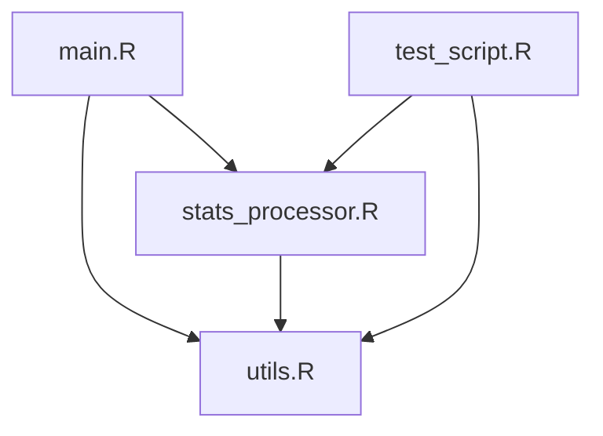

# Introduction

The objective of this project is to collect and analyze football players' statistics to gain insights into player performance and create a model to predict performance for fantasy football. In an era where data analytics plays an increasingly crucial role in sports, understanding and predicting player performance has become essential for both professional teams and fantasy football enthusiasts.

## Project Background

Fantasy football has evolved from a niche hobby into a global phenomenon, with millions of participants worldwide making weekly decisions about their virtual teams. The success in fantasy football heavily relies on the ability to accurately predict player performance based on historical data and current trends. This project aims to bridge the gap between raw statistical data and actionable insights through web scraping and advanced analytics.

## Project Objectives

The main objectives of this project are:

1. **Data Collection**: Systematically gather comprehensive player statistics from reliable football statistics websites using web scraping techniques in R. Due to the dynamically loaded nature of the target website, parsing data directly from the HTML was not possible. Instead, the data was extracted from JSON files loaded by the website, which required additional steps to identify and process the relevant API endpoints.

2. **Performance Analysis**: Analyze historical performance data to identify patterns and trends to find some unexpected insights in the data.

3. **Insight Generation**: Develop actionable recommendations for fantasy football managers based on the discovered patterns and statistical analysis.

## Significance

This project holds significance for several reasons:

1. **Practical Application**: The findings can be directly applied to fantasy football strategy, helping both casual players and experienced managers make more informed decisions about team selection and transfers in the English Premier League Fantasy game.

2. **Data Science Skills Development**: The project demonstrates the practical application of various data science skills, including:
- Web scraping
- Data cleaning and preprocessing
- JSON file parsing
- Statistical analysis
- Predictive modeling
- Data visualization

3. **Sports Analytics Innovation**: Contributing to the growing field of sports analytics by combining traditional statistics with modern data science techniques.

## Scope and Limitations

The project focuses on data from the English Premier League from season 2023/2024, scraped from [source website], with particular attention to statistics that are relevant for fantasy football scoring. While comprehensive, it's important to note that player performance can be influenced by numerous factors beyond historical statistics, such as:
- Team tactics
- Injuries
- Weather conditions
- Team chemistry
- Off-field factors

While the project aims to provide valuable insights for fantasy football managers, it's important to acknowledge its scope and limitations. Additionally, the reliance on JSON files for data extraction introduced some complexity, as the structure of the files required careful inspection and processing to ensure accurate data collection.

---

# Data Collection Process

## Tools and Libraries Used

The data was collected using the R programming language, specifically the following libraries:

```r
library(tidyverse)  # Collection of data manipulation packages
library(httr)       # HTTP request handling
library(jsonlite)   # JSON parsing and manipulation
library(stringi)    # String manipulation
```

## Source of Data

The data was scraped from [website URL], a comprehensive source of football statistics. The website provides detailed information on players, including:

- Player name
- Position
- Team
- Goals scored
- Assists
- Minutes played
- Passing accuracy
- Other relevant statistics

## Web Scraping Process

The web scraping process involved the following steps:

1. **Inspecting the Website**: Using browser developer tools to identify the structure of the HTML elements containing the desired data.
2. **Extracting Data**: Using the `rvest` package to extract the relevant data from the website.
3. **Cleaning Data**: Cleaning and structuring the data for analysis using `dplyr` and `stringr`.

Here is an example of the R code used for scraping:

```r
library(rvest)
library(dplyr)
library(stringr)

# Define the URL of the website
url <- "https://example-football-stats.com"

# Read the HTML content of the page
webpage <- read_html(url)

# Extract player names
player_names <- webpage %>%
  html_nodes(".player-name-class") %>%
  html_text()

# Extract player statistics (e.g., goals, assists)
goals <- webpage %>%
  html_nodes(".goals-class") %>%
  html_text() %>%
  as.numeric()

assists <- webpage %>%
  html_nodes(".assists-class") %>%
  html_text() %>%
  as.numeric()

# Combine data into a data frame
football_data <- data.frame(
  Player = player_names,
  Goals = goals,
  Assists = assists
)

# View the first few rows of the data
head(football_data)
```

## Challenges Faced

During the web scraping process, the following challenges were encountered:

- **Dynamic Content**: Some data was loaded dynamically using JavaScript, which required additional tools like `RSelenium` or APIs.
- **Rate Limiting**: The website imposed rate limits, which were addressed by introducing delays between requests using the `Sys.sleep()` function.
- **Data Cleaning**: Extracted data often contained unwanted characters or formatting issues, which were resolved using string manipulation functions.

---

# Data Analysis

## Methods Used



The analysis focused on exploring the relationships between various player statistics and identifying key performance indicators. The following methods were applied:

- Descriptive statistics to summarize the data.
- Correlation analysis to identify relationships between variables.
- Visualization techniques to present findings.

### Example Analysis Code

```r
library(ggplot2)

# Summary statistics
summary(football_data)

# Correlation between goals and assists
cor(football_data$Goals, football_data$Assists, use = "complete.obs")

# Visualization: Goals vs. Assists
ggplot(football_data, aes(x = Goals, y = Assists)) +
  geom_point(color = "blue") +
  labs(
    title = "Goals vs. Assists",
    x = "Goals Scored",
    y = "Assists"
  ) +
  theme_minimal()
```

### Findings

- **Top Performers**: The players with the highest goals and assists were identified.
- **Correlation**: A positive correlation was observed between goals and assists, indicating that players who score more goals also tend to provide more assists.
- **Team Analysis**: Teams with higher average player statistics were identified as top-performing teams.

---

# Conclusion

The analysis of football players' statistics provided valuable insights into player performance and team dynamics. Key findings include:

- The identification of top-performing players based on goals and assists.
- A positive correlation between goals and assists, suggesting that players who excel in one area often excel in the other.
- The importance of data-driven decision-making in football management.

These findings highlight the potential of web scraping and data analysis in sports analytics. Future work could involve expanding the dataset to include more seasons or exploring advanced statistical models for player evaluation.

---

# References

1. [Website URL](https://www.fotmob.com/en-GB/leagues/47/stats/premier-league?season=2023-2024): Source of football statistics.

```

---

### Notes:
1. Replace `[website URL]` and placeholder text with the actual source and details of your project.
2. Add more visualizations or analyses as needed.
3. Ensure the report is polished and formatted correctly before submission.