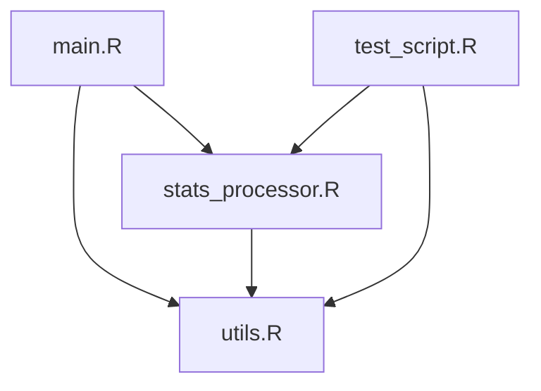

# Introduction

The objective of this project is to collect and analyze football players statistics to gain insights into player performance and collect data for future analysis and fantasy football prediction. Football analytics has become an essential tool for clubs, analysts, and fans to evaluate players and make data-driven decisions. This report outlines the web scraping process used to gather data from [source], the analysis conducted, and the conclusions drawn from the findings.

The significance of this project lies in its ability to demonstrate the practical application of web scraping and data analysis techniques in the field of sports analytics. By collecting and analyzing football players statistics, we aim to uncover patterns and trends that can inform decision-making in football management and strategy.

---

# Data Collection Process

## Tools and Libraries Used

The data was collected using the R programming language, specifically the following libraries:

- `rvest`: For web scraping.
- `httr`: For handling HTTP requests.
- `dplyr`: For data manipulation.
- `stringr`: For string processing.
- `ggplot2`: For data visualization.

To install these libraries, the following code was used:

```r
# Install required packages
install.packages(c("rvest", "httr", "dplyr", "stringr", "ggplot2"))
```

## Source of Data

The data was scraped from [website URL], a comprehensive source of football statistics. The website provides detailed information on players, including:

- Player name
- Position
- Team
- Goals scored
- Assists
- Minutes played
- Passing accuracy
- Other relevant statistics

## Web Scraping Process

The web scraping process involved the following steps:

1. **Inspecting the Website**: Using browser developer tools to identify the structure of the HTML elements containing the desired data.
2. **Extracting Data**: Using the `rvest` package to extract the relevant data from the website.
3. **Cleaning Data**: Cleaning and structuring the data for analysis using `dplyr` and `stringr`.

Here is an example of the R code used for scraping:

```r
library(rvest)
library(dplyr)
library(stringr)

# Define the URL of the website
url <- "https://example-football-stats.com"

# Read the HTML content of the page
webpage <- read_html(url)

# Extract player names
player_names <- webpage %>%
  html_nodes(".player-name-class") %>%
  html_text()

# Extract player statistics (e.g., goals, assists)
goals <- webpage %>%
  html_nodes(".goals-class") %>%
  html_text() %>%
  as.numeric()

assists <- webpage %>%
  html_nodes(".assists-class") %>%
  html_text() %>%
  as.numeric()

# Combine data into a data frame
football_data <- data.frame(
  Player = player_names,
  Goals = goals,
  Assists = assists
)

# View the first few rows of the data
head(football_data)
```

## Challenges Faced

During the web scraping process, the following challenges were encountered:

- **Dynamic Content**: Some data was loaded dynamically using JavaScript, which required additional tools like `RSelenium` or APIs.
- **Rate Limiting**: The website imposed rate limits, which were addressed by introducing delays between requests using the `Sys.sleep()` function.
- **Data Cleaning**: Extracted data often contained unwanted characters or formatting issues, which were resolved using string manipulation functions.

---

# Data Analysis

## Methods Used



The analysis focused on exploring the relationships between various player statistics and identifying key performance indicators. The following methods were applied:

- Descriptive statistics to summarize the data.
- Correlation analysis to identify relationships between variables.
- Visualization techniques to present findings.

### Example Analysis Code

```r
library(ggplot2)

# Summary statistics
summary(football_data)

# Correlation between goals and assists
cor(football_data$Goals, football_data$Assists, use = "complete.obs")

# Visualization: Goals vs. Assists
ggplot(football_data, aes(x = Goals, y = Assists)) +
  geom_point(color = "blue") +
  labs(
    title = "Goals vs. Assists",
    x = "Goals Scored",
    y = "Assists"
  ) +
  theme_minimal()
```

### Findings

- **Top Performers**: The players with the highest goals and assists were identified.
- **Correlation**: A positive correlation was observed between goals and assists, indicating that players who score more goals also tend to provide more assists.
- **Team Analysis**: Teams with higher average player statistics were identified as top-performing teams.

---

# Conclusion

The analysis of football players' statistics provided valuable insights into player performance and team dynamics. Key findings include:

- The identification of top-performing players based on goals and assists.
- A positive correlation between goals and assists, suggesting that players who excel in one area often excel in the other.
- The importance of data-driven decision-making in football management.

These findings highlight the potential of web scraping and data analysis in sports analytics. Future work could involve expanding the dataset to include more seasons or exploring advanced statistical models for player evaluation.

---

# References

1. [Website URL](https://www.fotmob.com/en-GB/leagues/47/stats/premier-league?season=2023-2024): Source of football statistics.

```

---

### Notes:
1. Replace `[website URL]` and placeholder text with the actual source and details of your project.
2. Add more visualizations or analyses as needed.
3. Ensure the report is polished and formatted correctly before submission.